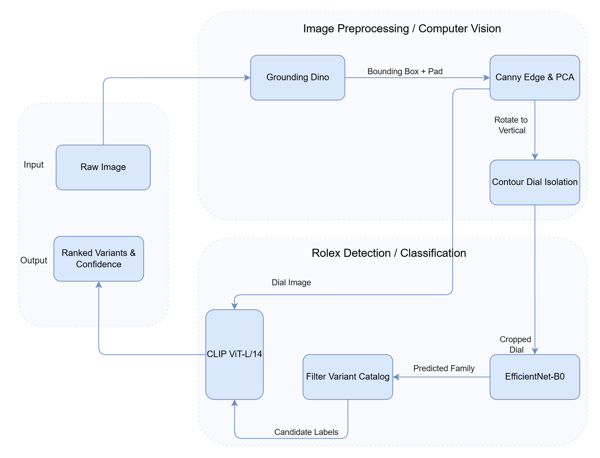

# [Rolex Finder(Click to see the website)](https://rolex-finder.vercel.app)
An end-to-end pipeline that identifies Rolex watches for raw user upload of images. The pipeline can detect the specific variant with reference ID of the Rolex model using a combination of Deep Learning + Classical Computer Vision + Zero-Shot Foundation Model.

This project stems from my love for watches, hence my aspiration of building a ML pipeline to detect Rolex elegant timepieces. 

Special thanks to my friend [Huy Phan, a.k.a. Hertzy](https://hertzy-da-poet.github.io/Hugo-Portfolio), for bringing the web interface into life. Hertzy implemented the entire front end and crafted the visual effects that shape the user experience.

## Authors
| **Phong Nguyen (Alex)** | **Huy Phan (Hertzy)** |
|---|---|
| **Deep Learning & Backend** | **Web Developing / UI-UX Design** |
| Built the Rolex classification model, web-scraping pipeline, recognition pipeline, backend API, model integration, and Modal deployment setup. | Developing the website from [Figma design](https://www.figma.com/design/JvzpwAEPhSpTFqzpf72Ezh/Rolex_Recog_UI?node-id=0-1&t=oeYxbgn8zixFBz3F-0): Creating interactions, visual effects, UI&UX refinement, and Vercel deployment. |
| GitHub: [@AlexDaPiggie](https://github.com/AlexDaPiggie)<br>LinkedIn: [Hoai Phong Nguyen](https://www.linkedin.com/in/hoai-phong-nguyen-9367a4384/?isSelfProfile=true) | GitHub: [@hertzy-da-poet](https://github.com/hertzy-da-poet)<br>LinkedIn: [Huy Phan](https://linkedin.com/in/huy-linkedin) |


---


# Key Features
## Frontend
-   **Intuitive Image Upload:** Supports pasting from the clipboard (Ctrl+V), browsing local files, and drag-and-drop functionality.
-   **AI-Powered Model Prediction:** Displays the most likely Rolex model along with a confidence percentage.
-   **Variant Candidate Analysis:** Shows a list of the closest known model variants, each with a match score and reference IDs.
-   **Quick Reference Search:** Provides one-click links to Google Images for each reference ID to aid in visual comparison and confirmation.
-   **Detailed Probability Breakdown:** Presents a table with the model's confidence scores across various Rolex families (e.g., Cellini, Daytona, Submariner).
-   **Responsive Design:** Features a clean, two-panel layout that adapts seamlessly to both desktop and mobile devices.
-   **Built-in Tutorial:** An interactive guide on the homepage helps first-time users get started quickly.

## Backend
- **Open-Vocubulary Object Detection**: Locates the watch in user's upload photos using Grounding DINO (Zero-shot object detection model). No mannual cropping needed.
- **PCA-Based Rotation Alignment**: Extracts the edge of bracelet using Canny edge detection and rotates the watch to 90 deg vertical using PCA (Principal Component Analysis).
- **Contour Dial Isolation**: Filters the 78% center (78% of the width & height), scores contour roundess, aspect & fill ratio, and center distance to crop the dial face.
- **Hierarchical Classification**:
    - **Stage 1**: Fine-tuned **EfficientNet-B0** classifies watch into 15 Rolex families (models), including Submariner, Daytona, Datejust, GMT-Master,... (See child-folders in ./data)
    - **Stage 2**: Zero-shot CLIP (openai/clip-vit-base-patch16) ranks specific reference variants (dial color, bezel type, material,...)
- **Direct Reference Links**: Generates one-click Google Images queries for the predicted reference IDs (e.g. `116610LN`, `126610LV`).
- **Serverless Cloud API**: Hosted on Modal (NVIDIA L4 GPU) with pre-baked Hugging Face cache layers and auto scale-down to disconnect when not in use (scaledown_windows = 180s).


## Architecture Pipeline



1. **Detection (`Grounding Dino`)**: Queries prompt `"watch. wristwatch."` to get bounding box and `PADDING_RATIO = 0.12` to collect the details of the dial in the bounding box.
2. **Alignment (`OpenCV + PCA`)**: Masks center dial, extracts bracelet edge pixels via Canny edge detector, computes primary axis with PCA. Rotates iamge if angle offset > 12 deg.
3. **Dial Extractoin (`Contour Scoring`)**: Searches center 78% bounding box (78% of width & height). Scores contours based on roundness, area ratio, center distance, and fill ratio. Crop dial with 40% padding (to preserve watch's details, avoid cutting watch, mimic train data) 
4. **Family Classification (`EfficientNet-B0`)**: Runs Softmax over 15 classes, outputs probability distribution and top predicted class.
5. **Variant Matching (`CLIP ViT-B/16`)** Queries `rolex_variants.json` for predicted family. Evaluates zero-shot image-text similarity accross candidate prompts. Returns the top-3 ranked variants with reference IDs examples.

---
## Quick Start (To run locally)
### Prerequisites
- Python 3.11+
- Node.js 18+
- Hugging Face Access Token (`HF_TOKEN`)

### 1. Backend Setup

```bash
# Clone repository
git clone https://github.com/AlexDaPiggie/Rolex_Finder_DeepLearning_Model.git
cd rolex_models_recognition

# Create virtual environment
python -m venv venv
venv\Scripts\activate      # Windows
# source venv/bin/activate # Linux/macOS

# Install dependencies
pip install -r requirements.txt

# Export Hugging Face token
$env:HF_TOKEN="your_hf_token"     # Windows PowerShell
# export HF_TOKEN="your_hf_token" # Linux/macOS

# Run FastAPI dev server
uvicorn src.api.main:app --host 0.0.0.0 --port 8000 --reload
```

- API Base URL: `http://localhost:8000`
- Swagger Docs: `http://localhost:8000/docs`

### 2. Frontend Setup

```bash
cd front_end
npm install
npm run dev
```

- UI URL: `http://localhost:5173`

---

## Serverless Cloud Deployment (Modal)

`modal_app.py` configures serverless GPU execution:

- **Build-Time Model Pre-baking**: Hugging Face models (`grounding-dino-base`, `clip-vit-base-patch16`) are downloaded during container build via `.run_function()`, eliminating cold-start download latency.
- **Auto Scale-Down**: Shuts down GPU after 3 minutes idle (`scaledown_window = 180s`, `min_containers = 0`).

```bash
modal secret create rolex-huggingface HF_TOKEN=your_token
modal deploy modal_app.py
```

---

## Repository Structure

```
Rolex_Finder_DeepLearning_Model/
├── data/                       # Scraped dataset & processed class mappings
├── front_end/                  # React + Vite frontend source
├── models/                     # PyTorch model weights (.pt)
├── src/
│   ├── api/
│   │   └── main.py             # FastAPI router, CORS, and inference endpoint
│   ├── collection/             # Web scraping scripts
│   ├── detection/
│   │   └── watch_cropper.py    # Grounding DINO detection, PCA alignment, contour dial extraction
│   ├── identify/
│   │   ├── clip_matcher.py     # Zero-shot CLIP ranking pipeline
│   │   ├── rolex_variants.json # Variant reference IDs and prompt catalog
│   │   ├── summary.py          # Output formatting utilities
│   │   └── variants.py         # Catalog lookup helpers
│   ├── inference/
│   │   ├── device.py           # Device resolver (CUDA / CPU fallback)
│   │   └── warmup.py           # Pre-warm model cache in memory
│   └── training/
│       ├── dataset.py          # PyTorch Dataset and augmentations
│       ├── evaluate.py         # Evaluation and validation metrics
│       ├── models.py           # EfficientNet-B0 architecture definition
│       └── train.py            # Training loop
├── modal_app.py                # Modal serverless GPU configuration
├── requirements.txt            # Python dependencies
└── README.md                   # Project documentation
```

---

## What are the Limitations of this Project ?
- **False Positives on images containing no watch**
    - The pipeline relies entirely on Grounding Dino with the prompt `"watch. wristwatch"` to detect whether a watch appears in the image or not. Consequently, if there's an object that looks like a watch/wristwatch, or in shape round, clocks, having bracelets,...; they would be mistaken for a watch. 
    - This problem could be addressed in the future by adding a particular watch classification model or a stricter bounding box.

- **Closed Catalog Constraints**
    - The model can only classify the 15 trained Rolex families in the catalog and could only detect among the variants for each family in `rolex_variants.json`. Rolex pieces that don't appear in the catalog couldn't be recognized. 
    - This is a trivial problem because the catalog for Rolex families almost cover all common/uncommon Rolex watches found on the Internet. Only rare/vintange/unique off-catalog watches could run into this problem. 

- **Severless cold-start latency (~40s)**
    - Modal platform scales down to 0 CPU instances when idel to elimate hosting costs. When cold start, it takes roughly 40 seconds to spin up the container and load models into GPU memory.
    - Because this project is maintained by one person with insufficient funding, running GPU 24/7 is impossible. A feasible solution would be implementing a lightweight CPU-based warm-up ping (Loading the Modal platform right at the moment someone opens up the website). 

- **Limited model architecture exploration**
    - The classifier currently only uses fine-tuned EfficientNet-B0 without benchmarking against other modern computer vision architectures. The reason is because training and benchmarking cost a huge amount of time (training EffNet-B0 takes ~5 hours), which would expand the time cost for this project significantly, not to mention that EfficientNet-B0 has already been an outstanding architecture for this project.
    - In the future, it's worth experimenting with ConvNeXt, Swin Transformers, or deeper EfficientNet variants (B4/B7) to compare the accuracy - latency trade-offs.

- **Ambiguity in CLIP**
    - The reason why CLIP is used in the first place is because training EfficientNet-B0 on every single Rolex variant would be an incredibly tedious task, requiring huge amount of data and time training, leaving alone the size of the model and latency for loading it on Modal. Hence, CLIP emerges as the best alternative for this problem. 
    - However, because CLIP embeddings rely entirely on text description, variants with similar description (metals, style, dial,...) could easily be mistaken for one another.

